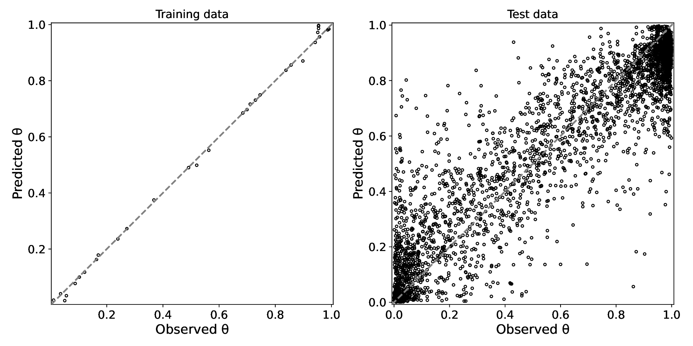
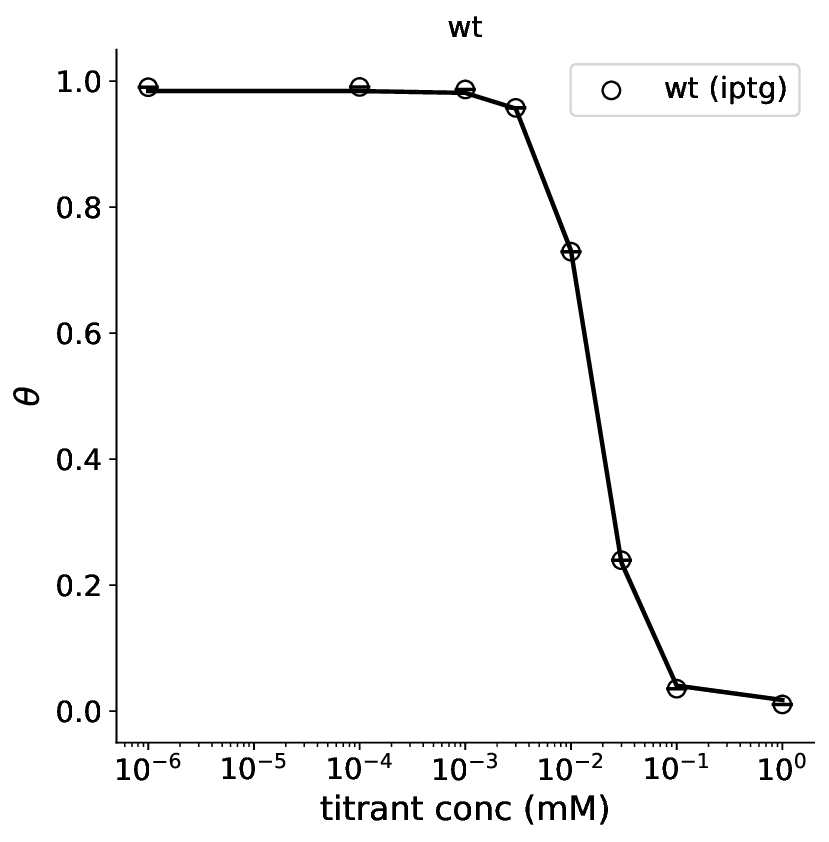
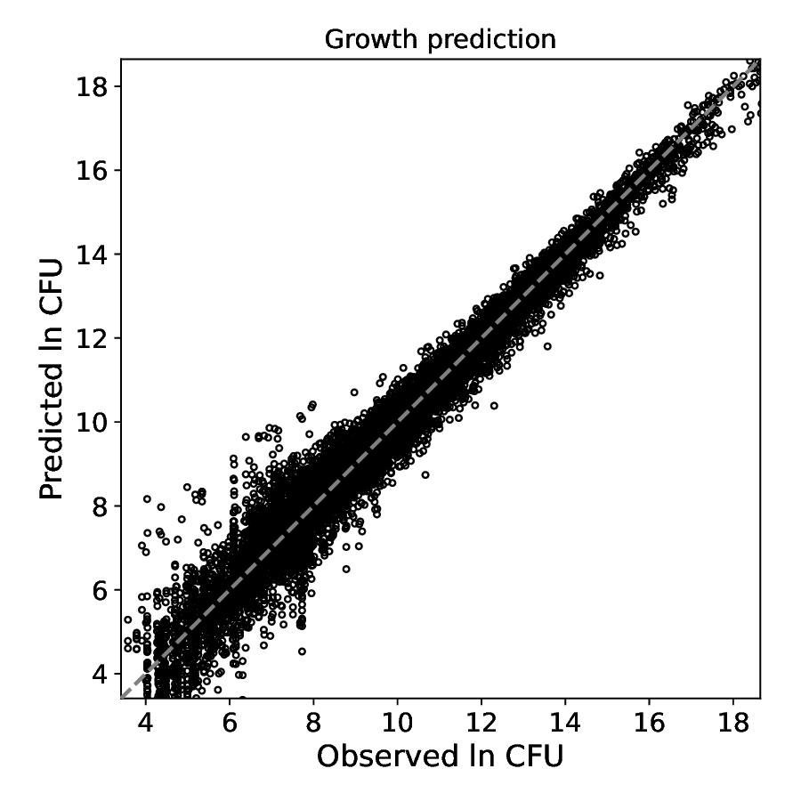
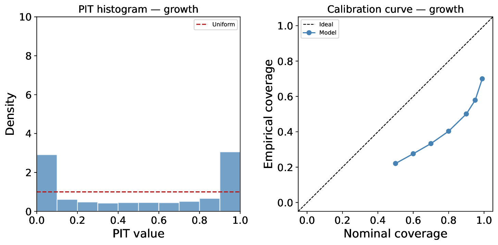
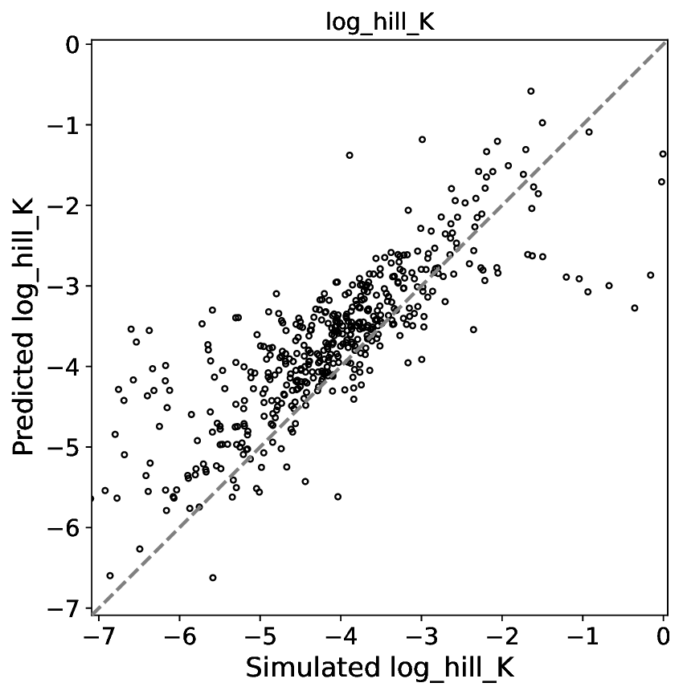

=================
tfs-summarize-fit
=================

``tfs-summarize-fit`` collects the outputs of a completed model-fitting run,
computes prediction quality statistics, and writes a set of diagnostic plots
and tables to a ``summary/`` subdirectory.

.. note::

   **CSV files are the authoritative outputs.**  Every PDF written by this
   command has a matching CSV containing the exact data used to generate it.
   Use the CSVs for downstream quantitative analysis; treat the PDFs as
   human-readable summaries.

Usage
-----

.. code-block:: bash

    tfs-summarize-fit <run_dir> [options]

**Positional arguments:**

* ``run_dir`` — directory containing the completed model-fit outputs (i.e.
  the ``out/`` directory produced by ``run.sh``).

**Optional arguments:**

* ``--ref_theta_file`` — CSV with columns ``genotype``, ``titrant_name``,
  ``titrant_conc``, and a ``theta_obs`` or ``theta`` column containing
  known θ values for evaluating out-of-sample predictions.  When omitted,
  the script automatically looks for ``*_sim_genotype_theta.csv`` in
  ``run_dir`` (the file written by ``tfs-simulate``).
* ``--out_prefix`` — prefix for all output files.  Defaults to
  ``{run_dir}/summary/tfs_summarize``.

What the script needs
---------------------

The script scans ``run_dir`` for:

* ``*_config.yaml`` — model configuration (required).
* ``*_pred_theta.csv`` — theta predictions from ``tfs-predict-theta`` (required).
* ``*_sim_genotype_theta.csv`` — ground-truth θ from ``tfs-simulate``
  (used for test statistics; absent for real-data runs).
* ``*_pred_growth.csv`` — growth predictions from ``tfs-predict-growth``
  (optional; enables growth statistics and plots).
* ``*_losses.txt`` — training loss history from ``tfs-fit-model``
  (optional; enables the loss-curve plot).
* ``*_params_*.csv`` — parameter summaries from ``tfs-extract-params``
  (optional; enables parameter-recovery plots when ``*_sim_parameters.csv``
  is also present).

Output file reference
---------------------

.. list-table::
   :header-rows: 1
   :widths: 45 55

   * - File
     - Contents
   * - ``tfs_summarize_fit_summary.json``
     - Nested statistics dict (see :ref:`fit-summary-json`).
   * - ``tfs_summarize_theta_corr.pdf`` / ``.csv``
     - Two-panel θ correlation: training (left) and test (right).
   * - ``tfs_summarize_theta_corr_training.csv``
     - Joined (ref, predicted) θ pairs for training genotypes.
   * - ``tfs_summarize_theta_corr_test.csv``
     - Same for test genotypes.
   * - ``tfs_summarize_growth_corr.pdf`` / ``.csv``
     - Observed vs predicted ln(CFU) across all training points.
   * - ``tfs_summarize_{genotype}_theta_fits.pdf`` / ``.csv``
     - Per-genotype θ curve overlaid with binding observations.
   * - ``tfs_summarize_{genotype}_trajectory.pdf`` / ``.csv``
     - Per-genotype predicted ln(CFU) vs time across all conditions.
   * - ``tfs_summarize_losses.pdf``
     - Training loss curve.
   * - ``tfs_summarize_theta_training_calibration.pdf``
     - Calibration plots for training θ (PIT histogram + coverage curve).
   * - ``tfs_summarize_theta_test_calibration.pdf``
     - Calibration plots for test θ.
   * - ``tfs_summarize_growth_calibration.pdf``
     - Calibration plots for growth predictions.
   * - ``tfs_summarize_params_{name}.pdf`` / ``.csv``
     - Per-parameter scatter of simulated vs inferred values (simulated
       data only).
   * - ``tfs_summarize_params_{name}_calibration.pdf``
     - Calibration plots for each inferred parameter (simulated data only).

Reading the outputs
-------------------

.. _fit-summary-json:

fit_summary.json — at a glance
~~~~~~~~~~~~~~~~~~~~~~~~~~~~~~~

The JSON file gives a rapid numerical overview of the run.  Open it in any
text editor or load it with ``json.load``.

.. code-block:: json

   {
     "metadata": {
       "n_parameters": 5005,
       "n_theta_training_points": 32,
       "n_theta_test_points": 3752,
       "n_growth_training_points": 54180,
       "final_loss": 7281255.0
     },
     "theta": {
       "training": { "pearson_r": 0.999, "r_squared": 0.998, "rmse": 0.016 },
       "test":     { "pearson_r": 0.936, "r_squared": 0.876, "rmse": 0.140 }
     },
     "growth": {
       "training": { "pearson_r": 0.981, "r_squared": 0.963, "rmse": 0.577 }
     }
   }

Key fields:

* ``n_parameters`` — total number of free parameters (from the guesses CSV).
  Compare to ``n_growth_training_points`` to check for over-parameterisation.
* ``final_loss`` — the converged SVI ELBO (negative; more negative = better).
  Use this to compare runs with identical data but different components or seeds.
* ``theta.training`` — statistics comparing the model's θ predictions against
  the direct **binding observations** used as training data.  These will
  always be near-perfect because the model is conditioned on these values.
* ``theta.test`` — statistics comparing θ predictions against the full
  ground-truth θ grid from ``tfs-simulate``.  This is the real generalization
  diagnostic: the vast majority of test points were never directly observed.
* ``growth.training`` — statistics comparing predicted ln(CFU) against the
  observed growth data.

Useful derived checks:

* ``theta.test.r_squared > 0.85`` is a reasonable threshold for a well-fitting
  model on a library of this size and noise level.
* A large gap between ``theta.training.rmse`` and ``theta.test.rmse`` signals
  that the model fits the spiked genotypes well but struggles to generalize
  to the broader library.
* ``residual_corr`` and its p-value test for autocorrelation in the residuals.
  A significant value indicates systematic structure the model is not capturing.

Training-loss curve (tfs_summarize_losses.pdf)
~~~~~~~~~~~~~~~~~~~~~~~~~~~~~~~~~~~~~~~~~~~~~~~

The loss curve shows the SVI ELBO at each recorded epoch.  A healthy run
shows a smooth decrease that levels off to a plateau; a run that has not
converged will still be declining at the final epoch.  If the loss spikes
upward mid-run, the learning rate or the prior scales may need adjustment.

Theta correlation (tfs_summarize_theta_corr.pdf)
~~~~~~~~~~~~~~~~~~~~~~~~~~~~~~~~~~~~~~~~~~~~~~~~~

   **Left panel** — training θ: the model's posterior-median prediction
   vs the direct binding observations used as input.  Near-perfect agreement
   is expected and is not by itself a measure of model quality.  **Right
   panel** — test θ: predictions vs the full ground-truth θ grid from
   simulation, covering all library genotypes at all concentrations.  Points
   far from the diagonal indicate genotypes or concentrations where the
   mutation-additivity assumption breaks down.

The two panels serve different purposes:

* **Training panel** confirms that the model correctly ingest the binding
  data — any large deviation here points to a data-loading or configuration
  error.
* **Test panel** is the generalization diagnostic.  The model must predict θ
  for thousands of genotypes that were never directly measured; it does so by
  combining per-mutation effects inferred from the spiked controls and the
  growth data.  Scatter around the diagonal reflects the irreducible noise in
  that extrapolation.

Per-genotype theta fits (tfs_summarize_{genotype}_theta_fits.pdf)
~~~~~~~~~~~~~~~~~~~~~~~~~~~~~~~~~~~~~~~~~~~~~~~~~~~~~~~~~~~~~~~~~~

   Wild-type θ curve: posterior-median prediction (line) overlaid with the
   binding observations (circles).  The x-axis is on a log scale.  A sigmoid
   transition from high θ at low [IPTG] to low θ at high [IPTG] is the
   expected shape for a repressor inactivated by its inducer.

One plot is produced per genotype that appears in both the binding data and
the theta predictions.  For spiked genotypes with measured binding curves
these plots confirm that the Hill model adequately describes the shape of the
induction curve.

Growth trajectories (tfs_summarize_{genotype}_trajectory.pdf)
~~~~~~~~~~~~~~~~~~~~~~~~~~~~~~~~~~~~~~~~~~~~~~~~~~~~~~~~~~~~~~

The trajectory plots show predicted ln(CFU) versus time for every growth
condition, with the observed data points (two replicates) overlaid on the
posterior-median prediction and its 95% credible interval.

One page is produced per genotype; each page contains one panel per
condition (library × selection × titrant concentration).  The dashed
vertical line marks the transition from pre-growth to selection medium.

Typical patterns to look for:

* **Pre-growth panels** (``kanR-kan``, ``pheS-4CP`` without selection):
  all genotypes should grow at similar rates; large deviations suggest a
  problematic ``dk_geno`` estimate.
* **Selection panels at extreme IPTG**: the two markers should respond in
  opposite directions as θ moves from ~1 to ~0 with increasing [IPTG].
* **Replicate agreement**: the two colored lines should be close together;
  large replicate-to-replicate variation indicates high tube noise or a
  confounded sample.

Growth correlation (tfs_summarize_growth_corr.pdf)
~~~~~~~~~~~~~~~~~~~~~~~~~~~~~~~~~~~~~~~~~~~~~~~~~~~~

   Observed vs predicted ln(CFU) across all genotypes, conditions, and
   time-points in the training data (54,180 points in the example run).
   Points cluster tightly along the diagonal except at low ln(CFU) values
   (~3–7), where sequencing noise dominates and the model's predictions
   spread somewhat.

A tight cluster along the diagonal confirms that the growth model
accurately reproduces the data.  Systematic vertical or horizontal bands
point to conditions or time-points where the model consistently over- or
under-predicts; these are usually caused by incorrect ``{m, b}`` priors for
those conditions or by tube-noise events in specific samples.

.. _calibration-plots:

Calibration plots (tfs_summarize_*_calibration.pdf)
~~~~~~~~~~~~~~~~~~~~~~~~~~~~~~~~~~~~~~~~~~~~~~~~~~~~~

   Growth-prediction calibration.  **Left** — PIT histogram; the dashed
   red line shows the ideal uniform distribution.  **Right** — calibration
   curve; the dashed black line is perfect calibration.

Calibration plots assess whether the model's **posterior uncertainty
intervals** are appropriately sized — neither too narrow (overconfident)
nor too wide (underconfident).

**PIT histogram** (left panel)

The Probability Integral Transform (PIT) value for each observation is the
fraction of the posterior predictive distribution that falls below the
observed value.  For a perfectly calibrated model, PIT values are
uniformly distributed on [0, 1] and the histogram should be flat.

* **U-shaped histogram** (spikes near 0 and 1, flat middle): many
  observations fall outside the predicted intervals → posterior is
  **overconfident** (intervals too narrow).
* **Hump-shaped histogram** (peak in the middle, low edges): observations
  cluster inside the predicted intervals → posterior is **underconfident**
  (intervals too wide).

**Calibration curve** (right panel)

For each nominal coverage level *α* (x-axis), the calibration curve shows
the empirical fraction of observations that fall within the model's *α*
credible interval (y-axis).

* **Below the diagonal**: empirical coverage < nominal → **overconfident**.
* **Above the diagonal**: empirical coverage > nominal → **underconfident**.
* **On the diagonal**: perfectly calibrated.

The example growth-calibration plot shows U-shaped PIT and a curve below
the diagonal.  This slight overconfidence in growth predictions is typical
of SVI: the mean-field variational approximation tends to underestimate
posterior variance.  It does not indicate a model misspecification; the
point predictions (correlation, R²) remain accurate.

Similar calibration plots are produced for theta (training and test) and for
each parameter group when ground-truth values are available.

Parameter recovery (tfs_summarize_params_{name}.pdf)
~~~~~~~~~~~~~~~~~~~~~~~~~~~~~~~~~~~~~~~~~~~~~~~~~~~~~

   Simulated vs inferred ``log_hill_K`` (log₁₀ of the Hill dissociation
   constant) for all library genotypes.  Each point is one genotype; the
   dashed line is perfect recovery.  Good agreement across the dynamic range
   confirms that the model correctly identifies which genotypes have shifted
   binding affinities.

Parameter-recovery plots are produced only when the run directory contains
a ``*_sim_parameters.csv`` file (i.e. when running on simulated data).  They
compare the posterior-median inferred value for each parameter against the
ground truth used during simulation.

One plot is produced per parameter group.  Versions are produced for:

* **Direct parameters** — per-genotype values (e.g. ``log_hill_K``,
  ``theta_high``, ``theta_low``, ``hill_n``).
* **Diff parameters** (``_d_`` infix) — per-mutation effect sizes relative to
  wild-type (e.g. ``d_log_hill_K``, ``d_logit_low``).
* **Epistasis parameters** (``_epi_`` infix) — pairwise epistatic deviations
  from additivity for double-mutant genotypes.

Each parameter group also has a companion calibration plot
(``*_calibration.pdf``) assessing whether the inferred uncertainty correctly
covers the true value.

Interpreting parameter recovery
^^^^^^^^^^^^^^^^^^^^^^^^^^^^^^^^

* Tight scatter around the diagonal for all parameters → model recovers the
  ground truth; the experimental design has sufficient signal.
* Tight recovery for direct parameters but wide scatter for diff/epi
  parameters → the model identifies which genotypes differ from wild-type
  but cannot resolve the per-mutation contributions as precisely.
* Systematic bias (all points shifted to one side of the diagonal) →
  mis-specified priors, an incorrect model component, or a calibration issue
  in the pre-fit step.
* Good recovery for ``log_hill_K`` but poor for ``hill_n`` or ``theta_high``
  → the mid-range of the induction curve is well-constrained but the shape
  of the saturation plateaux is not (common when the growth data covers only
  a restricted θ range for most genotypes).
