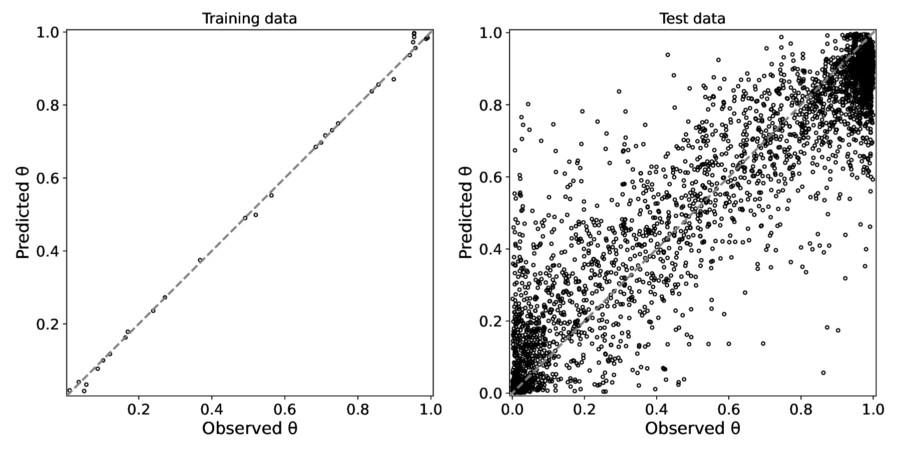
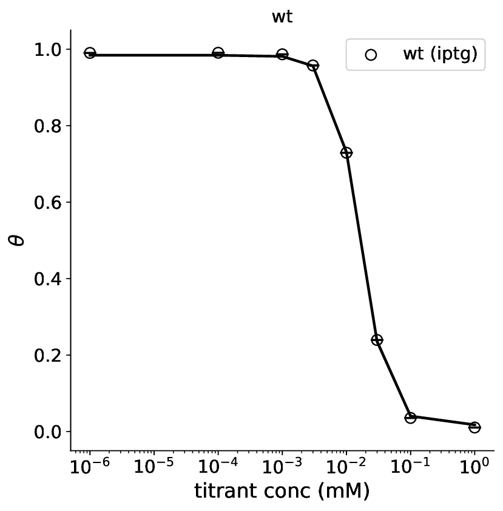
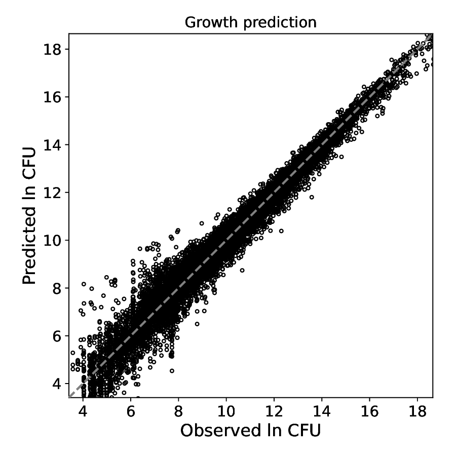
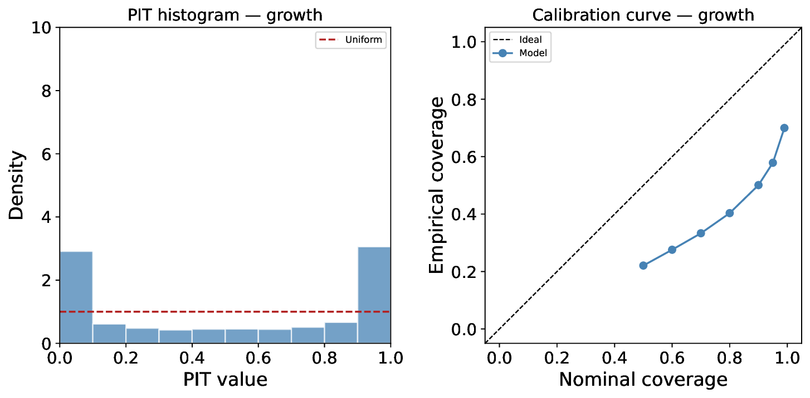
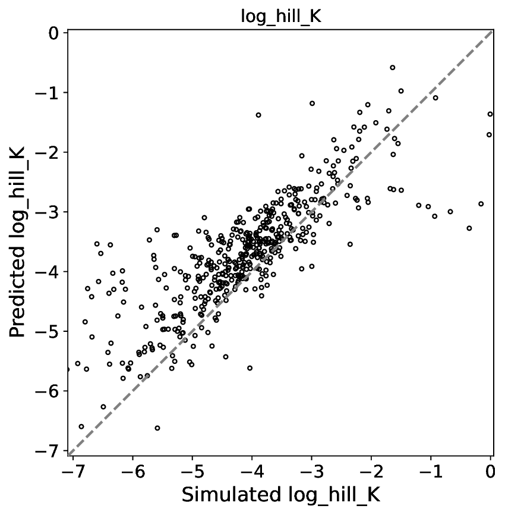

=================
tfs-summarize-fit
=================

``tfs-summarize-fit`` collects the outputs of a finished fit, computes
prediction statistics and writes diagnostic plots and tables. It is the quick
look at a run, and the place where simulated runs are scored against their
ground truth.

.. code-block:: bash

    tfs-summarize-fit out/

The one positional argument is the run directory. Outputs go to
``{run_dir}/summary/`` with the prefix ``tfs_summarize`` unless
``--out_prefix`` says otherwise. ``--ref_theta_file`` names a theta reference
table; see below. The full flag list is in :doc:`cli`.

Every PDF has a matching CSV holding the exact data behind it. Use the CSVs
for any quantitative analysis and treat the PDFs as summaries.

What the command reads
----------------------

The command finds its inputs by file-name suffix inside ``run_dir``. When
several files match, it warns and uses the first in alphabetical order. Each
missing input switches off only the outputs that need it.

``*_config.yaml``
    The model config from ``tfs-configure-model``. Other YAML files in the
    directory, such as a simulate config, are ignored. The config also points
    to the binding data, used as training theta, and to the guesses CSV.

``*_pred_theta.csv``
    Theta predictions from ``tfs-predict-theta``.

``*_pred_growth.csv``
    Growth predictions from ``tfs-predict-growth``. Optional.

``*_losses.txt``
    The loss history from ``tfs-fit-model``. The pre-MAP and pre-fit loss
    files (``*_premap_losses.txt``, ``*_prefit_losses.txt``) are skipped.
    Optional.

``*_posterior.h5`` or ``*_params.npz``
    The source for the growth trajectories, with the posterior preferred.
    ``tfs-sample-posterior`` writes ``{out_prefix}.h5``, so the default name
    ``tfs_posterior.h5`` matches but a custom prefix such as ``run1.h5``
    does not. The MAP ``*_params.npz`` from ``tfs-fit-model`` is the
    fallback. Optional.

``*_params_*.csv``
    Parameter tables from ``tfs-extract-params``. Compared to truth on
    simulated runs. Optional.

Simulated runs also have ground truth from ``tfs-simulate``:

``*_sim_genotype_theta.csv``
    True theta for every genotype and titrant point. Used as the theta test
    reference unless ``--ref_theta_file`` names another table. A reference
    table needs ``genotype``, ``titrant_name``, ``titrant_conc`` and a
    ``theta_obs`` or ``theta`` column.

``*_sim_parameters.csv``
    True per-genotype parameters.

``*_sim_growth_parameters.csv``
    True per-condition growth parameters.

``*_sim_k_ref.csv``
    The true base growth rate ``k_ref``.

``*_sim_transformation_lam.csv``
    The true congression rate ``lam`` of the ``mixture`` transformation.

Output files
------------

All names below use the default prefix ``tfs_summarize``.

.. list-table::
   :header-rows: 1
   :widths: 45 55

   * - File
     - Contents
   * - ``tfs_summarize_fit_summary.json``
     - Statistics and run metadata (see :ref:`fit-summary-json`).
   * - ``tfs_summarize_theta_corr.pdf``
     - Two-panel theta correlation: training on the left, test on the right.
   * - ``tfs_summarize_theta_corr_training.csv``
     - Training theta predictions joined to the binding observations, which
       are in the ``ref`` column.
   * - ``tfs_summarize_theta_corr_test.csv``
     - Theta predictions joined to the reference table, which is in the
       ``ref`` column.
   * - ``tfs_summarize_growth_corr.pdf`` / ``.csv``
     - Observed against predicted ln(CFU). The CSV is a copy of
       ``*_pred_growth.csv`` with ``ln_cfu`` and ``ln_cfu_std`` renamed to
       ``ref`` and ``ref_std``.
   * - ``tfs_summarize_{genotype}_theta_fits.pdf`` / ``.csv``
     - Predicted theta curve over the binding observations, one pair per
       binding genotype.
   * - ``tfs_summarize_{genotype}_trajectory.pdf`` / ``.csv``
     - Predicted ln(CFU) against time in every condition.
   * - ``tfs_summarize_losses.pdf``
     - The loss history.
   * - ``tfs_summarize_{name}_calibration.pdf``, ``_pit.csv``,
       ``_calibration_curve.csv``
     - Interval calibration for ``theta_training``, ``theta_test``,
       ``growth`` and each ``params_*`` table with a reference.
   * - ``tfs_summarize_params_{name}.pdf`` / ``.csv``
     - A parameter table with the true value added as ``ref``. Simulated
       runs only.
   * - ``tfs_summarize_tube_offsets.pdf`` / ``.csv``,
       ``tfs_summarize_tube_offset_trends.csv``
     - The per-tube sample offsets in prior SDs and their trends with titrant
       and time, one row per condition (see `Tube offsets`_). Fits with tube
       offsets only.

Slashes and spaces in genotype names become underscores in file names, so
``M42I/K84L`` gives ``tfs_summarize_M42I_K84L_trajectory.pdf``.

The theta fit plots need binding data with a ``theta_std`` column. The
trajectory plots need growth data and a posterior or params file. With binding
data, trajectories are drawn for the binding genotypes. Without it, they are
drawn for wt, the spiked genotypes and 10 other genotypes picked at random
with a fixed seed, so a rerun draws the same ones.

Calibration needs at least two ``q<level>`` columns. A MAP checkpoint passed
to the predict commands gives only ``q0.5``, so its predictions get
correlation statistics but no calibration outputs.

Relative-X fits
---------------

A ``hill_relative`` fit predicts the wt-relative growth variable X rather
than theta (see :doc:`model`). For such a fit, ``metadata.theta_scale`` in the
JSON is ``X``; it is ``theta`` otherwise. Simulated truth is mapped onto the
X scale before comparison. The mapping uses the gauge concentrations recorded
in the config, wt's true theta at those concentrations from the reference
table, and each genotype's simulated activity from ``*_sim_parameters.csv``.
The true ``growth_k`` and ``growth_m`` are mapped the same way: k becomes
wt's growth at the high gauge concentration and m its change between the two.
That mapping needs a single titrant. With several, the growth truth is left
blank. When the truth cannot be mapped, for example because the reference has
no wt value at a gauge concentration, the theta test comparison is skipped
with a warning rather than made on the wrong scale.

Reading the outputs
-------------------

.. _fit-summary-json:

The summary JSON
~~~~~~~~~~~~~~~~

``tfs_summarize_fit_summary.json`` has four top-level keys. ``metadata``
describes the run. ``theta`` holds ``training`` and ``test`` statistics, and
``growth`` holds ``training`` statistics. ``tube_offsets`` holds the
tube-offset summary (see `Tube offsets`_). A block that could not be
computed, or a fit without tube offsets, is ``null``. The example below, with illustrative values, is a simulated
growth-only run: there is no binding data, so ``theta.training`` is null.

.. code-block:: json

   {
     "metadata": {
       "run_dir": "/home/user/runs/run_0001/out",
       "ref_theta_file": "/home/user/runs/run_0001/out/tfs_sim_genotype_theta.csv",
       "timestamp": "2026-10-01T14:02:11.512340",
       "n_parameters": 412,
       "n_theta_training_points": null,
       "n_theta_test_points": 3752,
       "n_growth_training_points": 54180,
       "final_loss": 251873.4,
       "theta_scale": "X"
     },
     "theta": {
       "training": null,
       "test": {
         "pct_success": 1.0,
         "rmse": 0.071,
         "normalized_rmse": 0.058,
         "pearson_r": 0.968,
         "spearman_r": 0.951,
         "r_squared": 0.937,
         "mean_error": -0.004,
         "residual_corr": -0.12,
         "residual_corr_p_value": 1.3e-13,
         "bp_p_value": 0.002
       }
     },
     "growth": {
       "training": {
         "pct_success": 1.0,
         "rmse": 0.41,
         "normalized_rmse": 0.031,
         "pearson_r": 0.991,
         "spearman_r": 0.987,
         "r_squared": 0.982,
         "mean_error": 0.002,
         "residual_corr": -0.05,
         "residual_corr_p_value": 1.1e-31,
         "bp_p_value": 0.0
       }
     },
     "tube_offsets": null
   }

The metadata keys:

* ``run_dir`` and ``ref_theta_file`` are the resolved absolute paths.
  ``ref_theta_file`` is null when no reference was found.
* ``timestamp`` is when the summary ran.
* ``n_parameters`` is the number of rows in the config's guesses CSV, a rough
  size of the model.
* ``n_theta_training_points``, ``n_theta_test_points`` and
  ``n_growth_training_points`` count the points behind each statistics block.
* ``final_loss`` is the last entry of ``*_losses.txt``. Each entry is the
  median loss over one convergence window, not a single step. The loss is the
  negative ELBO for SVI and the negative log joint density for MAP. Lower is
  better, and it is usually positive. Compare it only between runs on the same
  data and model.
* ``theta_scale`` is ``X`` for a relative fit and ``theta`` otherwise.

Each statistics block compares the ``q0.5`` prediction with its reference:

* ``pearson_r``, ``spearman_r`` and ``r_squared`` measure agreement.
  Spearman tests whether genotypes are ranked correctly.
* ``rmse`` is the root mean squared error. ``normalized_rmse`` divides it by
  the 2.5 to 97.5 percentile range of the reference, so it reads as error
  relative to the signal.
* ``mean_error`` is the average of prediction minus reference, the bias.
* ``residual_corr`` and ``residual_corr_p_value`` test whether the error
  depends on the true value. A significant correlation means systematic
  structure, often shrinkage of the extremes toward the middle.
* ``bp_p_value`` is the Breusch-Pagan test. A small value means the error
  variance changes with the true value.
* ``pct_success`` is the fraction of predictions that are not NaN.
* Coverage of the reference by the posterior intervals is in the
  calibration outputs below, not in these blocks.

The three blocks mean different things. ``theta.training`` compares
predictions with the binding observations the model was fit to, so it should
be close to perfect. A poor value points to a data-loading or configuration
problem. ``theta.test`` compares predictions with the full reference grid,
which on a simulated run covers every genotype at every concentration, nearly
all of them never measured directly. That is the real test of the fit. A large
gap between training and test error means the model fits the anchors but does
not carry that accuracy to the library. ``growth.training`` compares
predicted with observed ln(CFU) for every observed point.

Tube offsets
~~~~~~~~~~~~

A ``level`` tube offset is meant to absorb tube noise: an error in a tube's
total or its composition, independent from tube to tube and about the size of
the OD600 scatter. On the dev data the MAP's better optimum used the offsets
for something else. Within each selection condition they followed IPTG, from
+2 to -4 ln units across 0 to 1 mM, and stayed constant over time, carrying
growth the model could not express (see :doc:`fitting`, "Staged MAP"). This
check makes that visible.

It reads ``*_sample_offset_offset.csv`` (``*_sample_offset_delta_k.csv`` for
``normal`` offsets) from ``tfs-extract-params``. The prior SD comes from
``*_sample_offset_sigma.csv`` when the SD was learned, or from
``sigma_fixed`` in the priors file when it was held.

* ``tfs_summarize_tube_offsets.csv`` is the offsets table with ``offset``
  (the ``q0.5``) and ``z``, the offset in prior SDs.
* ``tfs_summarize_tube_offset_trends.csv`` has one row per condition
  (``library``, ``condition_pre``, ``condition_sel``, ``titrant_name``):
  the mean and SD of the offsets, in ln units and in prior SDs; the Spearman
  correlation of the offset with titrant concentration (``rho_titrant``,
  ``p_titrant``) and with selection time (``rho_time``, ``p_time``);
  ``r2_titrant``, the share of the offsets' variance explained by the mean
  at each concentration, which catches a non-monotone pattern; and
  Benjamini-Hochberg q values over every condition and both trends.
  ``structured`` is true when either q is below 0.05.
* ``tfs_summarize_tube_offsets.pdf`` plots the offsets against titrant, one
  panel per selection condition, colored by time.
* The JSON's ``tube_offsets`` block holds ``n_tubes``, ``sigma`` and its
  source, the offsets' ``sd``, ``sd_over_sigma``, the median, 95th
  percentile and maximum of ``|z|``, the ``range``, and ``structured`` with
  the list of structured conditions.

Noise offsets have ``sd_over_sigma`` near 1 and no structured condition. A
structured fit is not wrong by construction, since a real tube effect can
trend with IPTG, but its offsets are carrying signal the growth model
leaves out, and its *k*, *m* and curves should not be read until that is
understood.

Loss history
~~~~~~~~~~~~

``tfs_summarize_losses.pdf`` plots each window's median loss against epoch.
A healthy run falls and levels off. A run still falling at the end did not
converge. ``*_convergence.csv`` from ``tfs-fit-model`` records why the run stopped; see
:doc:`fitting`.

Theta correlation
~~~~~~~~~~~~~~~~~

   Left: training theta, the posterior median against the binding
   observations used as input. Right: test theta, predictions against the
   simulated ground truth for every library genotype at every concentration.

The training panel confirms that the model took in the binding data. The test
panel is the generalization check. The model must predict theta for thousands
of genotypes never measured directly, so scatter around the diagonal reflects
how well growth alone pins each genotype down. Points far from the diagonal
mark genotypes or concentrations the model cannot resolve. On a relative fit
both axes are on the X scale.

Per-genotype theta fits
~~~~~~~~~~~~~~~~~~~~~~~

   Wild-type theta: the posterior median prediction as a line over the binding
   observations as points, on a log concentration axis. A repressor released
   by its inducer goes from high theta at low IPTG to low theta at high IPTG.

One plot is drawn per genotype found in both the binding data and the theta
predictions. These plots check that the theta model describes the shape of
each measured induction curve.

Growth trajectories
~~~~~~~~~~~~~~~~~~~

The trajectory plots show predicted ln(CFU) against time for every condition,
with the posterior median, its 95% interval and the observed points. Each
genotype gets one page with one panel per condition. A dashed vertical line
marks the switch from pre-growth to selection.

Things to look for:

* In pre-growth, genotypes should grow at similar rates. A large deviation
  suggests a poor ``dk_geno`` estimate.
* At the extremes of IPTG the two markers should move in opposite directions
  as theta goes from about 1 to about 0.
* Replicates should agree. Large disagreement points to tube noise or a
  confounded sample.

Growth correlation
~~~~~~~~~~~~~~~~~~

   Observed against predicted ln(CFU) for every genotype, condition and time
   point in the training data. Points spread more at low ln(CFU), where
   sequencing noise dominates.

A tight cluster along the diagonal means the growth model reproduces the data.
Vertical or horizontal bands mark conditions or time points the model over- or
under-predicts throughout. Those usually come from poor per-condition growth
priors or from bad tubes.

.. _calibration-plots:

Calibration
~~~~~~~~~~~

   Growth-prediction calibration. Left: PIT histogram, with the dashed red
   line at the ideal uniform. Right: calibration curve, with the dashed black
   line at perfect calibration.

Calibration asks whether the posterior intervals have the right width. The PIT
value of an observation is the fraction of its predictive distribution below
the observed value, interpolated from the ``q<level>`` columns. For a
calibrated model the PIT values are uniform on [0, 1] and the histogram is
flat. A U shape, with spikes near 0 and 1, means many observations fall
outside their intervals: the posterior is overconfident. A hump in the middle
means the intervals are too wide.

The calibration curve plots, for each nominal coverage level, the fraction of
observations inside that interval. Below the diagonal is overconfident and
above is underconfident. ``_pit.csv`` holds the PIT values (``true_val``,
``pit``) and ``_calibration_curve.csv`` the curve (``nominal``,
``empirical``).

The example shows a U-shaped PIT and a curve below the diagonal: the growth
intervals are somewhat too narrow, while the point predictions stay accurate.
Variational guides tend to understate posterior variance, so check calibration
before trusting interval widths. Theta calibration on a simulated run is the
more important check, since theta is what downstream analysis uses.

Parameter recovery
~~~~~~~~~~~~~~~~~~

   Simulated against inferred ``log_hill_K``, the natural log of the Hill
   constant, for every library genotype. Each point is one genotype and the
   dashed line is perfect recovery.

Parameter recovery runs only on simulated runs. Each ``*_params_*.csv`` table
from ``tfs-extract-params`` is matched to its truth, written with a ``ref``
column as ``tfs_summarize_params_{name}.csv``, plotted against ``q0.5`` and
checked for calibration.

* Per-genotype tables such as ``log_hill_K``, ``hill_n``, ``theta_low``,
  ``theta_high`` and ``dk_geno`` take their truth from
  ``*_sim_parameters.csv``. Tables on a log or logit scale are matched by
  transforming the truth.
* ``hill_mut`` per-mutation tables (``d_`` prefix) are compared with the true
  value minus wt's. Pair tables (``epi_`` prefix) are compared with the
  additive epistasis of the true values.
* ``params_growth_k``, ``params_growth_m`` and the other growth-model tables
  are joined to ``*_sim_growth_parameters.csv`` on ``condition_rep``.
* ``params_k_ref`` and ``params_lam`` are single values compared with
  ``*_sim_k_ref.csv`` and ``*_sim_transformation_lam.csv``. They get a CSV
  and a calibration check but no plot.

A table whose truth cannot be resolved is skipped. A truth column with no
matching parameter table produces a warning.

How to read recovery:

* Tight scatter around the diagonal means the design has the signal to
  recover the parameter.
* Good recovery of per-genotype values with wide scatter in ``d_`` or
  ``epi_`` values means the model sees which genotypes differ but cannot split
  the difference into per-mutation parts as precisely.
* A shift of all points to one side points to a misspecified prior, a wrong
  component or a problem in the pre-fit calibration.
* Good ``log_hill_K`` with poor ``hill_n`` or ``theta_high`` means the
  midpoint of the curve is well constrained and its plateaus are not. That is
  common when most genotypes span only part of the theta range.
